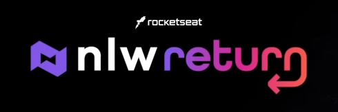
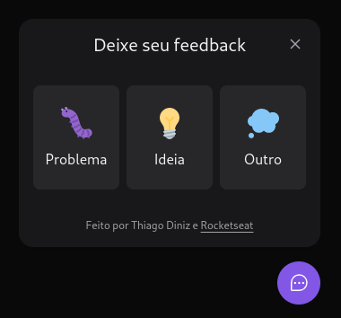

# NLW RETURN

```Next Level Week (NLW) Return``` was a free, online event hosted by Rocketseat that took place in May 2022.



I participated in the Impulse track, where we developed a complete application ([frontend](web), [backend](server) and [mobile](mobile)) using technologies such as ReactJS, React Native, Node.js and TypeScript.

The application developed was called "Feedget" (Feedback Widget) and it is a widget for collecting user feedback that can be added to any website/application.



Rocketseat built the application layout in Figma tool ([available here](https://www.figma.com/file/qiRqsjxTRbRCef7sUSweFd/Feedback-Widget-(Community)?node-id=100%3A2114)) and shared it with us to use as a reference in the application development.

